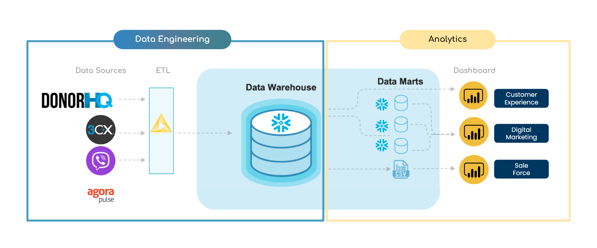
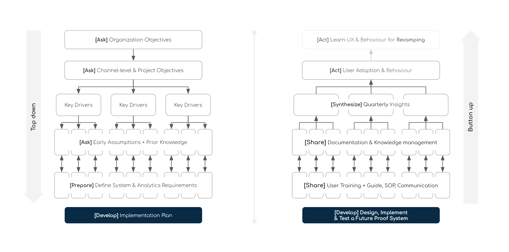
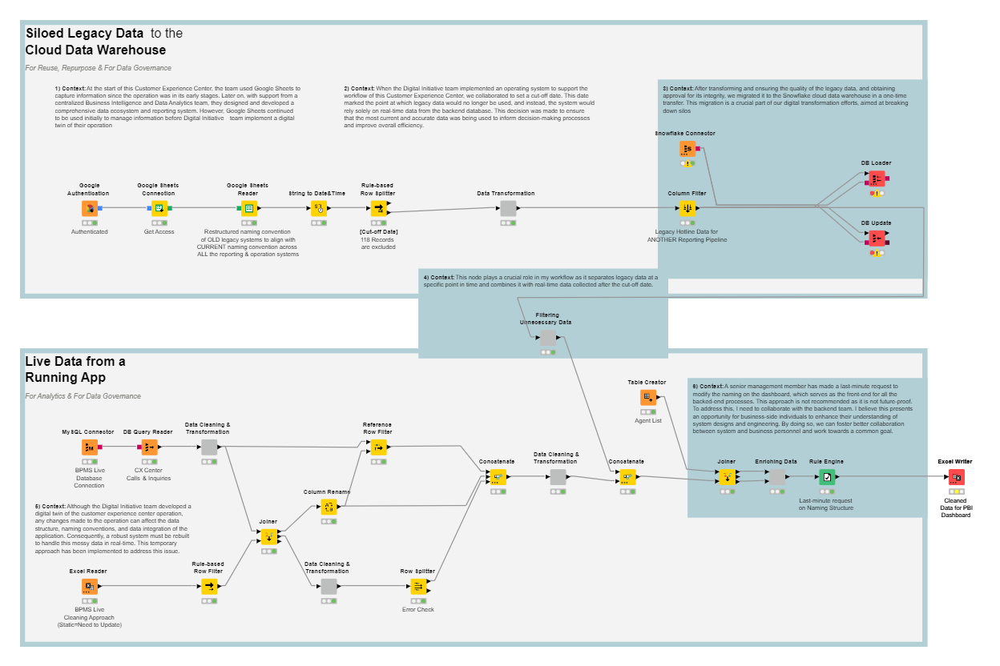
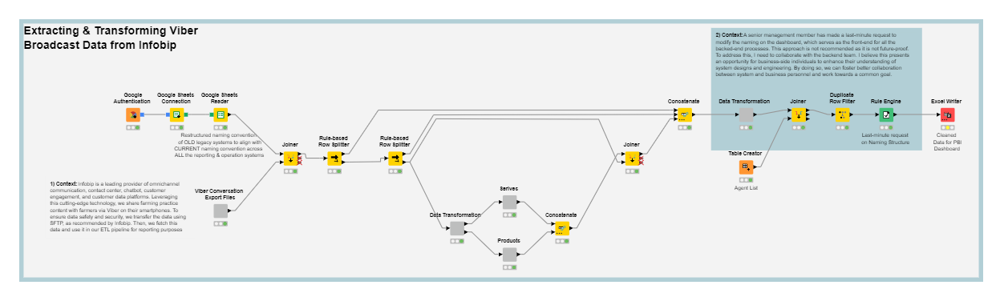
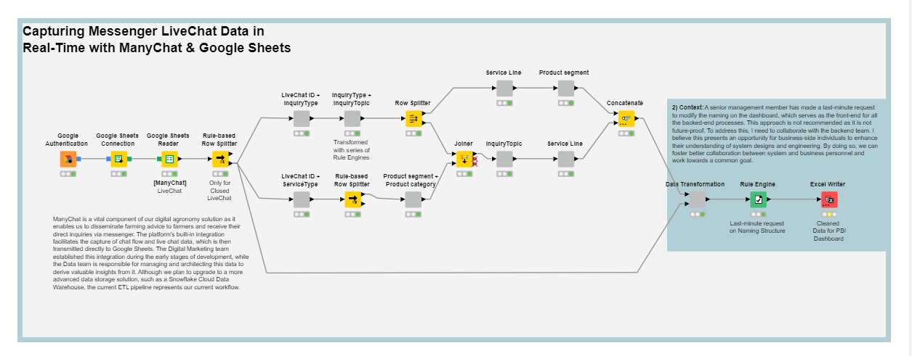
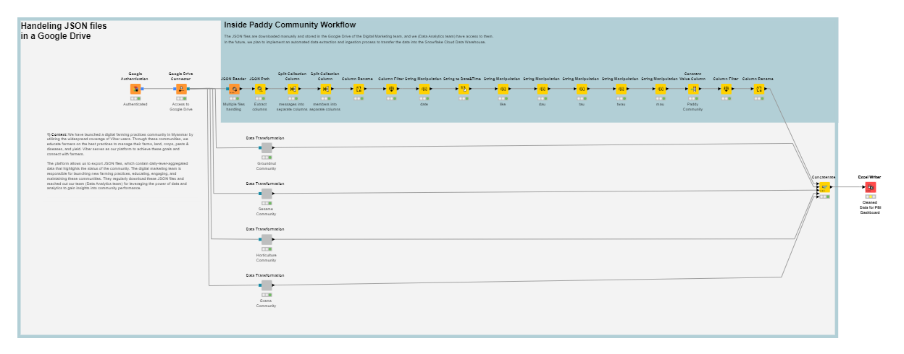
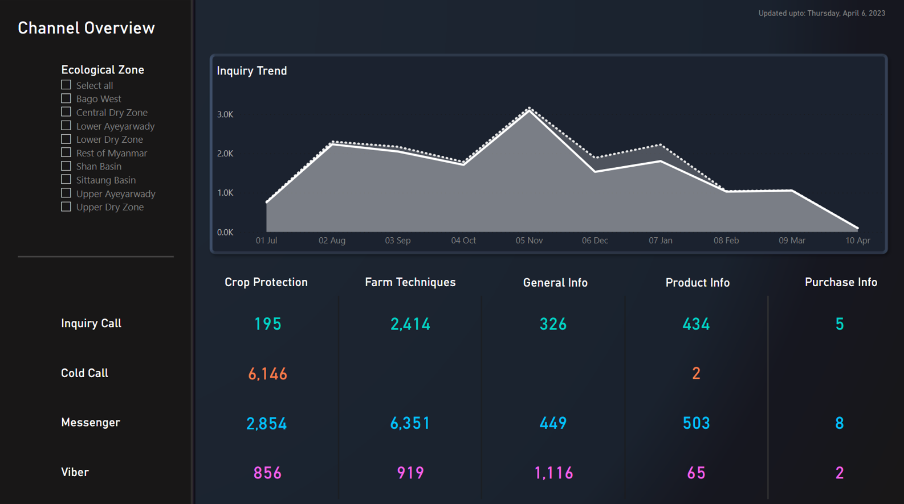
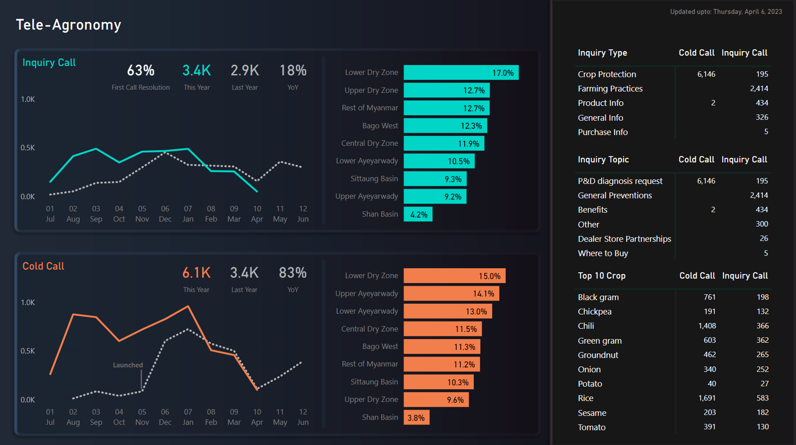
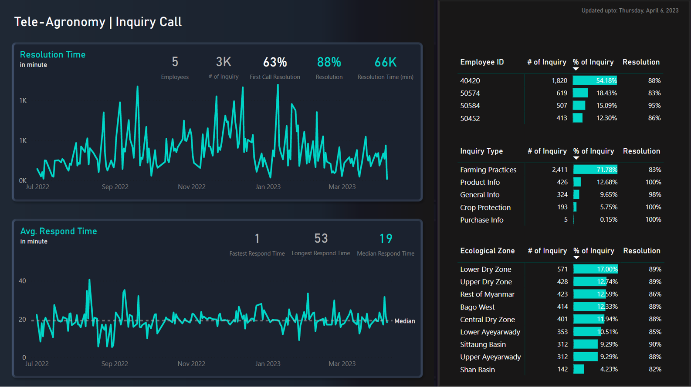

# Background

AGRICULTURAL CALL CENTER is a platform that operate with many different technologically driven systems — for instance, the knowledge bank, email, SMS, and other digitally operated infrastructure. Then there are databases and Customer Relationship Management (CRM) software. These systems can vary widely, from simple Excel spreadsheets with farmers’ names, numbers, and questions, to tailored software systems created by information technology specialists. Across agriculture centers globally, call center operators have a background and some experience in agriculture. Although almost all agricultural call centers rely on in-house “knowledge banks”. A knowledge bank is the central information database used by the call center. 

In our case, we choose to create our own knowledge bank — a robust data ecosystem to track and analyze key performance metrics. This enables us better decision-making and support the existing service channels. This (knowledge bank) plays a vital role in providing customer support and sale support through various channels, such as hotline, direct communication, and social media. This team also plays a crucial role in many organizations digital transformation strategy aimed at providing extensive support to a wide variety of users. As the organization scales up its digital operations, there is a need to establish a robust data ecosystem to track and analyze key performance metrics, which will enable better decision-making and support the existing service channels.I discuss my experience in implementing a knowledge system for Agricultural Call Center. [(Read More About THISD:D)](https://bit.ly/3nkxqOC)




> The project aims to create a comprehensive data ecosystem for the CEC team, which includes developing ETL workflows, a data repository, a dashboard, and SOPs for maintaining the workflow and dashboard. As part of the project, an audit of the existing data structure will be conducted, and a new template will be recommended to integrate data from multiple sources.


# Project Deliverables
- Project charter [(See More)](https://bit.ly/43OcuA1)
- ETL workflow [(See More)](https://bit.ly/43Wj9s0)
- Data defination [(See More)](https://bit.ly/3n9NKSo)
- Wireframe
- Dashboard [(See More)](https://bit.ly/41tLZ1e)
- SOP [(See More)](https://bit.ly/3NxrWLf)
- User training
- Meeting notes [(See More)](https://bit.ly/3VmnccX)

### Requirement Collection Approach




# ETL Workflow Diagrams [(KNIME)](https://www.knime.com/getting-started-guide)


> Combine Siloed Data with Production Data: At the start of this Customer Experience Center, the team used Google Sheets to capture information since the operation was in its early stages. Later on, with support from a centralized Business Intelligence and Data Analytics team, they designed and developed a comprehensive data ecosystem and reporting system. However, Google Sheets continued to be used initially to manage information before Digital Initiative team implement a digital twin of their operation


> Infobip to KNIME: Infobip is a leading provider of omnichannel communication, contact center, chatbot, customer engagement, and customer data platforms. Leveraging this cutting-edge technology, we share farming practice content with farmers via Viber on their smartphones. To ensure data safety and security, we transfer the data using SFTP, as recommended by Infobip. Then, we fetch this data and use it in our ETL pipeline for reporting purposes


> Messenger LiveChat & Google Sheet Integration: ManyChat is a vital component of our digital agronomy solution as it enables us to disseminate farming advice to farmers and receive their direct inquiries via messenger. The platform's built-in integration facilitates the capture of chat flow and live chat data, which is then transmitted directly to Google Sheets. The Digital Marketing team established this integration during the early stages of development, while the Data team is responsible for managing and architecting this data to derive valuable insights from it. Although we plan to upgrade to a more advanced data storage solution, such as a Snowflake Cloud Data Warehouse, the current ETL pipeline represents our current workflow.


> JSON from Viber Community: We have launched a digital farming practices community in Myanmar by utilizing the widespread coverage of Viber users. Through these communities, we educate farmers on the best practices to manage their farms, land, crops, pests & diseases, and yield. Viber serves as our platform to achieve these goals and connect with farmers.  The platform allows us to export JSON files, which contain daily-level-aggregated data that highlights the status of the community. The digital marketing team is responsible for launching new farming practices, educating, engaging, and maintaining these communities. They regularly download these JSON files and reached out our team (Data Analytics team) for leveraging the power of data and analytics to gain insights into community performance.

# Data modelling
I use pre-agreated data for this for this portfolio project. It helps me reduce the amount of data and sensitive information that needs to be processed for analyses or reporting. It involves summarizing or grouping data at a higher level of granularity, such as by week or month, instead of processing every individual record. I use THREE pre-agreation methods: 
- Summarizing data by time intervals (daily basics)
- Aggregating data by categories (less granularity in dimension data)
- Filtering data to exclude irrelevant records (omit senstive information)

[](./Diagrams/Data_Modeling.png)

### DAX used in this SAMPLE Dashboard [(See More)](https://bit.ly/3n9NKSo)

```
# of Inquiry (Hotline) =
CALCULATE (
    SUM ( 'Inquiry Data [Hotline]'[# of Inquiry] )
)
```
```
# of Inquiry LY (Hotline) = 
CALCULATE(
    [# of Inquiry (Hotline)],
    SAMEPERIODLASTYEAR ( 'Master Data [Business Calendar]'[Date]))
```
```
# of Inquiry Solved (Hotline) =
CALCULATE (
    SUM ( 'Inquiry Data [Social Media]'[# of Inquiry] ),
    'Inquiry Data [Social Media]'[Status] = "Solved"
)
```
```
# of Inquiry (All Channels) = 
VAR Hotline = [# of Inquiry (Hotline)]
VAR SocialMedia = [# of Inquiry (Social Media)]

RETURN 
CALCULATE(Hotline + SocialMedia)
```

### SQL Query

```
SELECT 
  a.InquiryID,
  a.CallID,
  b.CallSerialNo,
  b.UserName,
  b.PhoneNumber,
  b.Gender,
  b.VillageTract,
  b.Township,
  b.State,
  d.InquiryTopic,
  e.InquiryType,
  c.Crop,
  b.CallType,
  b.AgentID,
  f.ReferralType,
  g.BranchName,
  a.FirstHandlerStatus,
  a.SecondHandlerStatus,
  a.SecondHandDateTime,
  a.CustomerOptions,
  a.ProductandService,
  a.ReasonForNoAction,
  b.Remark
FROM 
  CEC_inquiries a 
  RIGHT JOIN CEC_calls b ON b.ID = a.CallID 
  LEFT JOIN CEC_cropmaster c ON c.CropID = a.CropID 
  LEFT JOIN CEC_inquirytopic d ON d.InquiryTopicID = a.InquiryTopicID 
  LEFT JOIN CEC_inquirytype e ON e.InquiryTypeID = a.InquiryTypeID 
  LEFT JOIN CEC_referraltype f ON f.ReferrelTypeID = a.ReferralTypeID 
  LEFT JOIN branches g ON g.BranchID = a.ReferredBranchID

```

### Batch Script
```
C:\"Program Files"\KNIME\knime.exe -consoleLog -nosplash -application org.knime.product.KNIME_BATCH_APPLICATION -workflowFile=A:\Knime-workflow\automatedscripts\Name_of_Workflow.knwf -reset -nosave

if %errorlevel% == 0 (
goto :message0)
if %errorlevel% == 2 (
goto :message2)
if %errorlevel% == 3 (
goto :message3)
if %errorlevel% == 4 (
goto :message4)

:message0
@echo off
cls
echo ========= Workflow completed successfully ===========
pause
exit

:message2
@echo off
cls
echo ======== Parameters are wrong or missing ===========
pause
exit

:message3
@echo off
cls
echo ========= Errors occurs during loading the workflow ===========
pause
exit

:message4
@echo off
cls
echo ========= Workflow did not complete successfully =========== 
pause
exit
```
# Dashboard [(See More)](https://bit.ly/41tLZ1e)

> This overview tab provides a bird's eye view of the Customer Expereince Center's ability to respond to and serve customers effectively, highlighting the Center's success in managing diverse customer interactions across multiple channels.


> This tab provides a comprehensive and thorough analysis of the various types of inquiries that the Customer Expereince Center has addressed over the course of the fiscal year. This section presents a detailed and insightful examination of the different types of inquiries that the Customer Expereince Center has encountered, offering an in-depth look into the Center's performance and effectiveness in addressing these inquiries.


> This section of the dashboard will delve into Customer Expereince Center Daily Operation. Specifically, the primary focus will revolve around the various aspects of team performance, including response time, which plays a crucial role in maintaining effective and efficient Customer Expereince Center.
